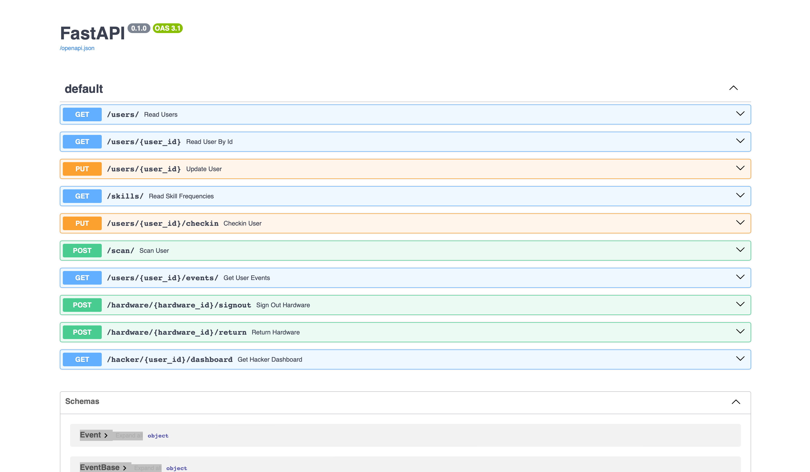
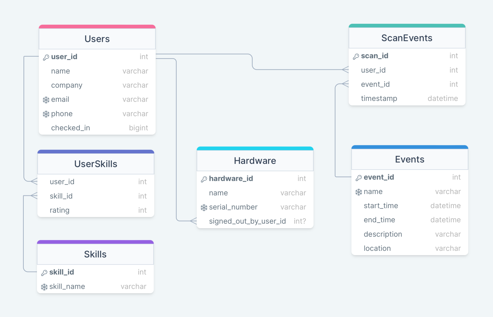

# HTN 2024 Backend Developer Challenge

Hack the North 2024 Backend Developer Challenge

This repository contains a FastAPI application with a SQLite database, using SQLAlchemy as the ORM.

## Startup Instructions

### Prerequisites

Before you begin, ensure you have met the following requirements:

- You have a `Windows/Linux/Mac` machine.
- You have installed Python `3.6+`.

### Cloning the Repository

To clone this repository, run the following command in your terminal (or command prompt):

```bash
git clone https://github.com/Ri-Hong/htn-2024-backend-developer-challenge.git
```

### Installing Dependencies

To install the required dependencies, follow these steps:

1. Navigate to the project directory:

   ```bash
   cd htn-2024-backend-developer-challenge
   ```

2. Create a virtual environment:

   - For Windows:

     ```bash
     python -m venv venv
     ```

   - For macOS/Linux:

     ```bash
     python3 -m venv venv
     ```

3. Activate the virtual environment:

   - For Windows:

     ```bash
     .\venv\Scripts\activate
     ```

   - For macOS/Linux:

     ```bash
     source venv/bin/activate
     ```

4. Install the requirements:

   ```bash
   pip install -r requirements.txt
   ```

### Loading the Database

Load the challenge data with:

```bash
python3 app/db_init.py
```

That program creates a database file called sql_app.db in the root directory of the project and populates it with data from HTN_2023_BE_Challenge_Data.json. Note that this script is destructive, meaning that running it will delete the existing database file and create a new one.

### Testing

To run the tests, run the following command:

```bash
pytest ./app/test_api.py
```

Note that running the tests will modify the database, so it is strongly recommended to run 
```bash
python3 app/db_init.py`
```
after running the tests to reset the database.

### Starting the Application

Before starting the FastAPI application, it is recommended to restart Visual Studio Code to ensure the venv is updated with the new libraries. If VSCode is not restarted, there might be this error `ImportError: cannot import name 'field_validator' from 'pydantic'`

To start the FastAPI application, run the following command:

```bash
uvicorn app.main:app --reload
```

### Updating Dependencies

To update requirements.txt, run the following command:

```bash
pip freeze > requirements.txt
```

### Accessing the Application



After starting the application, there is an autogenerated documentation page adhering to the OpenAPI standard that can be accessed at:
[http://127.0.0.1:8000/docs#/](http://127.0.0.1:8000/docs#/)

This page also provides an interface for directly calling endpoints from the browser, eliminating the need of using Postman or other related API testing software.

## App Structure

- `app/`: The main app package.
  - `__init__.py`: Used to denote the app package as a module.
  - `main.py`: The entry point for the FastAPI app.
  - `models.py`: The database models for the app, defined using SQLAlchemy.
  - `schemas.py`: The Pydantic models for the app, used for request and response validation.
  - `database.py`: The database connection and session management.

## Tools

- `db_init.py` A script to initialize the database with the data from HTN_2023_BE_Challenge_Data.json
- `test_api.py` A script to test the API endpoints

## Notes and Assumptions

Some data had some strange entries, so the following assumptions were made and the data was cleaned accordingly. Note that the following behaviours are implemented in the db_init.py script.

1. Emails and phone numbers must be unique. If we try to insert a participant with an email or phone number that already exists, we will skip that participant and log a warning message.

2. Each user cannot have the same skill with multiple ratings. If we try to insert the a skill that already has a rating under the same user, we will skip that skill and log a warning message.

db_init.py will output warning messages if any of the above assumptions are violated.

## Database Schema



The database schema consists of 5 tables: `Users`, `Skills`, a junction table `UserSkill`, `Hardware`, `Events`, `ScanEvents`.

### User

- `user_id`: integer, primary key
- `name`: string
- `email`: string, unique
- `phone`: string, unique
- `checked_in`: boolean

### Skill

- `skill_id`: integer, primary key
- `skill_name`: string, unique

### UserSkill (Junction Table)

- `user_id`: integer, foreign key to `User.user_id`
- `skill_id`: integer, foreign key to `Skill.skill_id`
- `rating`: integer

### Hardware

- `hardware_id`: integer, primary key
- `name`: string
- `serial_number`: unique string
- `signed_out_by_user_id`: integer, foreign key to `User.user_id`

### Events

- `event_id`: integer, primary key
- `name`: unique string
- `start_time`: datetime
- `end_time`: datetime
- `description`: string
- `location`: string

### ScanEvents

- `scan_id`: integer, primary key
- `user_id`: integer, foreign key to `User.user_id`
- `event_id`: integer, foreign key to `Event.event_id`
- `timestamp`: datetime

### Relationships

- A `User` can have multiple `UserSkill` records. (One-to-Many relationship)
- A `Skill` can have multiple `UserSkill` records. (One-to-Many relationship)
- The `UserSkill` table serves as a junction table to facilitate a Many-to-Many relationship between `User` and `Skill`.
- A `User` can have multiple `ScanEvents` records. (One-to-Many relationship)
- An `Event` can have multiple `ScanEvents` records. (One-to-Many relationship)
- A `User` can have multiple `Hardware` records. (One-to-Many relationship)

## Design Consinderations

1. We don't store the the skills and ratings as an array in the participants table in order to preserve normalization. Normalization aims to reduce redundancy and improve data integrity by ensuring that each piece of data is stored only once. Working with denormalized data can cause these issues:

   - **Query Complexity**: Searching, filtering, or joining data based on values within an array can be more complex and less efficient than with normalized data.
   - **Data Integrity**: Ensuring the integrity of data within an array (e.g., no duplicates, valid values) is more challenging.
   - **Updates and Scalability**: Modifying a single element within an array requires reading and rewriting the entire array, which can be inefficient. As the data grows, these operations can become increasingly cumbersome and slow.

2. We have a seperate table for Skills and a seperate junction table for the many to many relationship between participants and skills. We do this for the following reasons:

- **Avoiding Redundancy**: Storing skill names directly in the ParticipantSkills table would lead to redundancy. The same skill name would be repeated for each participant possessing that skill, consuming more storage and potentially leading to inconsistencies (e.g., spelling errors leading to the same skill being listed under multiple variations).
- **Data Integrity and Consistency**: A separate Skills table ensures that each skill is defined once and only once, maintaining a single source of truth. This approach prevents inconsistencies in skill names and makes it easier to update or correct a skill name across all associations.
- **Efficiency**: Linking participants to skills through IDs is more efficient than using text strings. Integer comparisons (IDs) are faster than string comparisons (skill names), which can improve the performance of queries, especially as the dataset grows.
- **Flexibility for Future Changes**: If we need to add more information about a skill (e.g., a description, category, or proficiency level required), having a separate Skills table makes it easier to extend the database schema without affecting the structure of other tables.
- **Simplifying Relationships**: By using a ParticipantSkills junction table, we can easily manage many-to-many relationships between participants and skills, including storing additional information about each association, such as the rating, without complicating the schema.

## API Endpoints

- `GET /users`: Get a list of all users (with optional filters for cheked_in_only, skip and limit)
- `GET /users/{user_id}`: Get a user by their ID.
- `PUT /users/{user_id}`: Update a user by their ID (allows for partial updating).
- `GET /skills`: Get a list of all skills (with optional filters for minimum and maximum
  frequency)
- `PUT /users/{user_id}/checkin`: Checks the user in
- `POST /scan`: Scans a user into an event
- `GET /users/{user_id}/events/`: Get a list of all events that a user has been scanned into
- `POST /hardware/{hardware_id}/signout`: Signs out a piece of hardware
- `POST /hardware/{hardware_id}/return`: Returns a piece of hardware
- `GET /hacker/{user_id}/dashboard`: Gets information related to a hacker

### `GET /users`

Returns a json list of all users in the database.

Optional arguments:

- `skip` (int): The number of users to skip over . Defaults to 0
- `limit` (int): The number of users to return. Defualts to 100
- `checked_in_only` (bool): If true, only returns users who are checked in. Defaults to false

#### Example Request

Get all users.

```
GET /users
```

#### Example Response

```json
[
  {
    "name": "Andrew Stark",
    "company": "Barry Group",
    "email": "wrobinson@example.org",
    "phone": "336.286.5914",
    "checked_in": true,
    "skills": [
      {
        "skill": "Sed",
        "rating": 3
      },
      {
        "skill": "Smalltalk",
        "rating": 3
      }
    ]
  },
  {
    "name": "Jenny Smith",
    "company": "Ortiz-Adams",
    "email": "geraldstein@example.com",
    "phone": "596.231.3418",
    "checked_in": false,
    "skills": [
      {
        "skill": "PHP",
        "rating": 4
      },
      {
        "skill": "Materialize",
        "rating": 1
      },
      {
        "skill": "Svelte",
        "rating": 1
      },
      {
        "skill": "Unreal Engine",
        "rating": 2
      }
    ]
  }
  ...
]
```

### `GET /users/{user_id}`

Returns a json object of a user with the given user_id.

#### Example Request

Get the user with user_id 1.

```
GET /users/1
```

#### Example Response

```json
{
  "name": "Emily May",
  "company": "Graham Group",
  "email": "estradadana@example.org",
  "phone": "947.098.3138x493",
  "checked_in": false,
  "skills": [
    {
      "skill": "Foundation",
      "rating": 1
    },
    {
      "skill": "Julia",
      "rating": 3
    },
    {
      "skill": "Spectre.css",
      "rating": 4
    },
    {
      "skill": "Ruby",
      "rating": 4
    }
  ]
}
```

### `PUT /users/{user_id}`

Updates a user with the given user_id.

Takes the user's ID as a parameter, and a json body with a dictionary of fields to update.

If fields exist (e.g. `name`, `email`, `phone`, `company`), they will be updated. If they do not exist, they will be ignored. All of these fields are optional and are treated as text. If there are multiple valid fields of the same type, the last field of that type in the json body will be used.

Skills provided in the body will be used to updated the existing skills. This endpoint will only add new skills or update the ratings of existing skills. It will not delete any skills. Ratings must be integers between 1 and 5, or the request will return a 400 Bad Request. Similar to the user fields, if there are multiple skills of the same type, the first skill of that type in the json body will be used and all duplicate skills ignored.

#### Example Request

Update the phone number of the user with user_id 1.

```
PUT /users/1
```

```json
{
  "phone": "123-456-7890"
}
```

#### Example Response

```json
{
  "name": "Emily May",
  "company": "Graham Group",
  "email": "estradadana@example.org",
  "phone": "123-456-7890",
  "checked_in": false,
  "skills": [
    {
      "skill": "Foundation",
      "rating": 1
    },
    {
      "skill": "Julia",
      "rating": 3
    },
    {
      "skill": "Spectre.css",
      "rating": 4
    },
    {
      "skill": "Ruby",
      "rating": 4
    }
  ]
}
```

### `GET /skills`

Returns a json list of all skills and their associated frequencies in the database.

Optional arguments:

- `min_frequency` (int): The minimum frequency of the skill. Defaults to 0
- `max_frequency` (int): The maximum frequency of the skill. Defaults to infinity

#### Example Request

Get all skills with frequencies between 10 and 15.

```
GET /skills/?min_frequency=10&max_frequency=15
```

#### Example Response

```json
[
  {
    "skill_name": "Svelte",
    "frequency": 14
  },
  {
    "skill_name": "Ada",
    "frequency": 14
  }
]
```

### `PUT /users/{user_id}/checkin`

Checks the user in. If the user is already checked in, this endpoint will return a 400 Bad Request.

Arguments:

- `user_id` (int): The ID of the user to check in.

#### Example Request

Check in the user with user_id 1.

```
PUT /users/1/checkin
```

#### Example Response

```json
{
  "name": "Emily May",
  "company": "Graham Group",
  "email": "estradadana@example.org",
  "phone": "947.098.3138x493",
  "checked_in": true,
  "skills": [
    {
      "skill": "Foundation",
      "rating": 1
    },
    {
      "skill": "Julia",
      "rating": 3
    },
    {
      "skill": "Spectre.css",
      "rating": 4
    },
    {
      "skill": "Ruby",
      "rating": 4
    }
  ]
}
```

### `POST /scan`

"Scans" a user by adding an entry into the "ScanEvents" table. If the user is already checked in, this endpoint will return a 400 Bad Request.

Arguments:

- `user_id` (int): The ID of the user to scan.
- `event_id` (int): The ID of the event to scan the user into.

#### Example Request

Scan the user with user_id 1 into an event with event_id 1.

```
POST /scan/?user_id=1&event_id=1
```

```json
{
  "message": "User scanned successfully"
}
```

### `GET /users/{user_id}/events/`

Get a list of all events that a user has been scanned into.

Arguments:

- `user_id` (int): The ID of the user to get events for.

#### Example Request

Get all events that the user with user_id 1 has been scanned into.

```
GET /users/1/events/
```

#### Example Response

```json
[
  {
    "name": "Vonage API Workshop",
    "description": "A Nanoleaf Shapes Mini Triangle Smarter Kit will be awarded to each member of the winning team for Best Use of Vonage API. Vonage is a cloud communications platform that allows developers to integrate voice, video and messaging into their applications using their communication APIs. So whether you want to build video calls into your app, create a Facebook bot, or build applications on top of programmable phone numbers, Vonage has got you covered",
    "event_id": 1
  }
]
```

### `POST /hardware/{hardware_id}/signout`

Signs out a piece of hardware by "signed_out_by_user_id" field to be the user_id of the person signing out the hardware.

Arguments:

- `hardware_id` (int): The ID of the hardware to sign out.
- `user_id` (int): The ID of the user signing out the hardware.

#### Example Request

Sign out the hardware with hardware_id 1 by the user with user_id 1.

```
POST /hardware/1/signout/?user_id=1
```

```json
{
  "message": "Hardware Arduino Uno signed out by user 1 (Breanna Dillon)"
}
```

### `POST /hardware/{hardware_id}/return`

Returns a piece of hardware by setting the "signed_out_by_user_id" field to null.

Arguments:

- `hardware_id` (int): The ID of the hardware to return.

#### Example Request

Return the hardware with hardware_id 1.

```
POST /hardware/1/return
```

```json
{
  "message": "Hardware Arduino Uno returned by user 1 (Breanna Dillon)"
}
```

### `GET /hacker/{user_id}/dashboard`

Gets information related to a hacker.

Arguments:

- `user_id` (int): The ID of the user to get information for.

#### Example Request

Get information for the user with user_id 1.

```
GET /hacker/1/dashboard
```

#### Example Response

```json
{
  "user_info": {
    "name": "Breanna Dillon",
    "company": "Jackson Ltd",
    "email": "lorettabrown@example.net",
    "phone": "+1-924-116-7963",
    "checked_in": true
  },
  "signed_out_hardware": [
    {
      "name": "Arduino Uno",
      "serial_number": "ARD123456UNO"
    },
    {
      "name": "Raspberry Pi 4",
      "serial_number": "RPI1234564"
    }
  ],
  "checked_in_events": [
    {
      "name": "Vonage API Workshop",
      "description": "A Nanoleaf Shapes Mini Triangle Smarter Kit will be awarded to each member of the winning team for Best Use of Vonage API. Vonage is a cloud communications platform that allows developers to integrate voice, video and messaging into their applications using their communication APIs. So whether you want to build video calls into your app, create a Facebook bot, or build applications on top of programmable phone numbers, Vonage has got you covered",
      "start_time": "2021-01-12T09:00:00",
      "end_time": "2021-01-12T09:30:00",
      "location": "MC 2025"
    }
  ]
}
```
